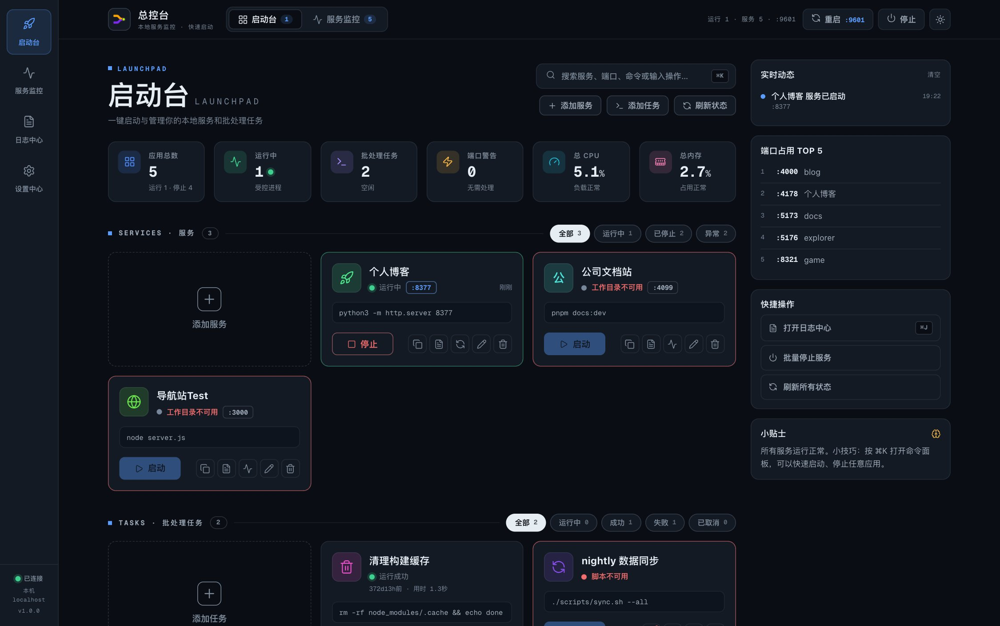
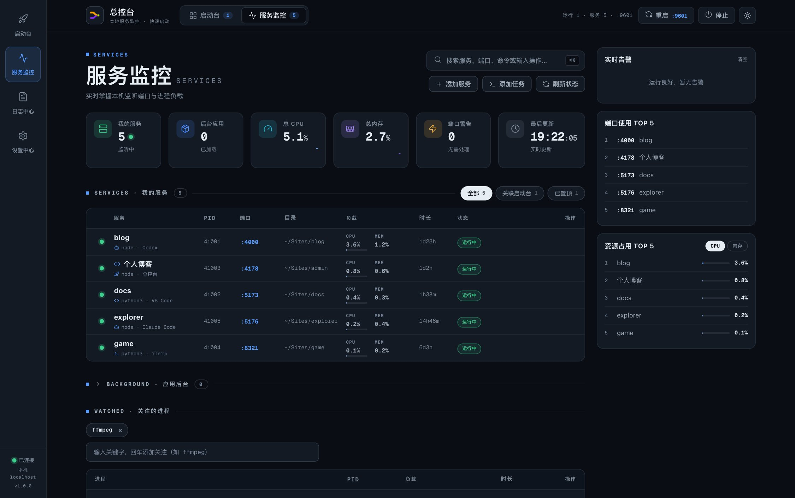

# 总控台

**Preview / Alpha · Windows 未签名内测 / macOS 源码预览**

总控台是面向 Windows 和 macOS 的本地服务与批处理任务快速启动、运行监测工具。它把常用项目命令、长期服务和一次性任务集中到只绑定本机回环地址的网页中。前端是无构建、无 CDN 的原生 HTML/CSS/JavaScript；macOS 源码运行时仅用 Python 3 标准库，Windows 安装包则自带 Python 运行时和所需依赖。

> 当前版本仍处于 Preview / Alpha 阶段。Windows 交付物是未经 Authenticode 签名的 x64 内测包，可能触发 Microsoft Defender SmartScreen；macOS 仍以完整源码目录提供，`总控台.app` 不是可单独复制的自包含应用，也未经签名或公证。接口、配置和安装方式在内测期间仍可能调整。

总控台只服务当前电脑和当前用户，不是远程运维、多人协作或公网管理面板。它能够以当前 Windows/macOS 用户（或选定 WSL2 发行版的默认用户）权限执行保存的 shell 命令；不要将监听地址、反向代理、SSH 隧道或端口映射暴露到不受信任的网络。

## 功能

- 每 2 秒查看当前用户的本地监听服务、CPU、内存和运行时长。
- 保存常用服务或批处理任务，集中启动、停止、重启、查日志和诊断。
- 在当前页面会话中发现新出现的、尚未管理的监听端口，可直接加入启动台或忽略隐藏。
- 运行前检查工作目录、脚本和运行时；明确失效时直接给出修复入口，不必先失败一次。
- 从项目文件夹识别常用启动命令，但不安装依赖、不执行项目代码。
- 通过运行 token 和完整进程身份安全识别受控进程：macOS 验证进程组/UID，Windows 验证 SID/创建时间，WSL2 验证发行版 boot ID/UID/start ticks/命令与目录哈希，不会因端口相同就结束外部进程。
- Windows 原生命令可选自动、CMD 或 Windows PowerShell；同一界面可启动和监控正在运行的 WSL2 发行版内服务。
- Ops 指挥台单一主题：深空蓝黑/雾灰双色，左侧导航轨、KPI 概览卡、实时动态侧栏，浅色、深色和跟随系统。
- 顶栏提供 `EN | 中` 语言开关，可即时切换整套内建界面的英文或中文；选择会保存在当前浏览器中，刷新页面后仍然生效。
- 全局命令面板可直接添加服务或批处理任务；启动台卡片支持鼠标拖拽和键盘排序。

## 界面预览

以下截图使用脱敏演示数据，不包含真实用户名、目录、命令或服务信息。

| 启动台 | 服务监控 |
| --- | --- |
|  |  |

## 系统要求

### Windows 安装版

- Windows 10 22H2（build 19045）或 Windows 11，x64/AMD64。Windows ARM64 不支持。
- 安装和使用不需要管理员权限，也不需要另行安装 Python；Python 3.12、`psutil`、`pywin32` 等运行组件已包含在 PyInstaller `onedir` 产物中。
- 现代默认浏览器。界面会由托盘宿主在浏览器中打开，不内嵌 WebView。
- WSL 功能为可选项：需要 WSL2 和 x86_64 发行版。WSL1 不支持（界面会给出 `wsl --set-version <发行版> 2` 提示）；发行版不需要 Python、`ps` 或 `lsof`。

### macOS 源码版

- macOS 12 或更高版本。
- Python 3.12；运行时仅使用 Python 标准库。
- macOS 自带的 `ps`、`lsof`、`osascript` 等系统工具，以及 Safari、Chrome 或其他支持 ES Modules 的现代浏览器。

`VERSION` 是应用版本的唯一权威来源。macOS `Info.plist`、Windows Inno/PyInstaller `release-manifest.json`、发行包名和发行说明应与它保持一致；supervisor 与 WSL helper 的协议版本独立管理，不得用应用 `VERSION` 替代。

## 安装

### Windows x64 未签名内测包

1. 从项目 GitHub Releases 下载 `local-ops-<版本>-windows-x64-setup.exe`、`SHA256SUMS.txt` 和 `UNSIGNED_BUILD_NOTICE.txt`，不要使用来源不明的镜像。
2. 安装前在 PowerShell 计算哈希，并与同一发布的 `SHA256SUMS.txt` 逐字比对：

   ```powershell
   Get-FileHash .\local-ops-*-windows-x64-setup.exe -Algorithm SHA256
   ```

3. 运行安装器。该内测包未经 Authenticode 签名；若 SmartScreen 拦截，只有在下载源和 SHA-256 均已核对后，才选择“更多信息”→“仍要运行”。哈希不匹配时立即取消。
4. 默认按当前用户安装到 `%LOCALAPPDATA%\Programs\总控台`，不会请求管理员权限。“登录 Windows 后启动托盘”是可选且默认不勾选。

安装包内的 `release-manifest.json`、SPDX 2.3 SBOM 和 Python 依赖清单用于内测审计；它们不代替对安装包 SHA-256 和来源的核验。

### macOS 源码目录

macOS 以完整项目目录运行，`总控台.app` 是项目内启动器，不是可以单独复制的自包含应用。

1. **下载并解压**：将发行 zip 解压到一个你有读写权限的位置（如 `~/Applications` 或文稿下的固定目录）。解压后请保持目录结构完整，不要单独移动 `总控台.app`。
2. **确认 Python 3.12**：在「终端」运行：

   ```bash
   python3 --version
   ```

   显示 3.12 或更高即可。未安装或版本过低时，到 <https://www.python.org/downloads/> 下载官方 macOS 安装包，按向导安装一次即可（之后不再需要操作）。
3. **首次打开（未签名应用，二选一）**：
   - 图形方式：在 `总控台.app` 上**点右键 → 打开**，在弹窗中再点「打开」。只需做一次。
   - 命令行方式（等价，适合批量或远程）：

     ```bash
     xattr -dr com.apple.quarantine "总控台.app"
     ```

     之后即可正常双击。这是 macOS 对互联网下载应用的常规隔离提示，不是程序损坏。

## 运行

### Windows 托盘宿主

从开始菜单或安装目录启动 `总控台.exe`。它常驻系统托盘，启动只绑定 `127.0.0.1` 的 HTTP 服务，然后用默认浏览器打开界面。同一 Windows 用户只会有一个托盘实例；再次启动只会唤醒现有实例并打开页面。托盘菜单提供打开、启动、停止、重启 HTTP 服务和退出；退出前会明确提示已受管应用仍将继续运行。

Windows 原生应用的 `auto` Shell 会将普通命令交给 `cmd.exe /d /s /c`，`.ps1` 交给 Windows PowerShell；也可明确选择 CMD 或 PowerShell。总控台不会自动绕过 PowerShell 执行策略。WSL2 应用使用选定发行版的默认用户和 `/bin/sh -lc`；第一次使用时会核验随包 helper 的 SHA-256，再安装到该用户的私有目录。监控只扫描已经在运行的 WSL2 发行版，不会为监控而启动已停止的发行版。

### macOS 源码运行

启动总控台有三种方式，效果相同，按习惯选择：

| 方式 | 操作 | 适用场景 |
| --- | --- | --- |
| 双击应用 | 双击 `总控台.app` | 日常使用。后台运行，无 Terminal 窗口和 Dock 图标 |
| 双击脚本 | 双击 `start.command` | 想在 Terminal 里看实时输出 |
| 命令行 | `python3 server.py` | 调试、脚本化或远程 SSH 启动 |

命令行还有两个可选参数：

```bash
python3 server.py --no-browser        # 只启动服务，不自动打开浏览器
python3 server.py --preferred-port 9603  # 在 9600-9609 内指定优先端口
```

两个平台都只绑定 `127.0.0.1`，从 9600 起尝试端口，被占用则递增（最多 10 个），并自动打开浏览器。macOS 源码运行的命令行参数、环境变量（`CONSOLE_DATA_DIR` / `CONSOLE_LOG_DIR`）见下文“数据、隐私与备份”。Windows 安装版始终使用安全的当前用户目录，不接受继承的运行目录覆盖。

**实际地址在哪里看**：顶栏「重启 :9600」按钮上直接显示当前端口。Windows 可查看 `%LOCALAPPDATA%\总控台\logs\desktop.log`，macOS 可查看终端输出或 `~/Library/Logs/总控台/console.log`。浏览器手动访问 `http://127.0.0.1:端口号/` 即可。

**停止与重启**：顶栏「重启 / 停止」控制的是总控台自身（网页服务）。停止或重启总控台**不会**停止启动台里已经运行的应用。macOS 使用独立进程组；Windows 使用持久化、版本化 supervisor 以及不启用 `KILL_ON_JOB_CLOSE` 的 Job Object。下次打开总控台时会用保存的完整身份重新识别原生和 WSL2 应用。

## 使用

打开页面后，左侧是导航轨，右侧是信息栏；所有数据每 2 秒自动刷新。

### 启动台（管理你的服务与任务）

- **添加服务/任务**：点「+ 添加服务」卡片或页头快捷按钮。选择工作区文件夹后会自动识别项目类型（Node/pnpm、Hexo/Hugo、Django/FastAPI、Go、Rust、静态站点等）并给出候选命令；也可以「选择脚本」或完全手动填写。`service` 是长期服务（带端口语义），`task` 是有明确结束时间的批处理（强制无端口）。
- **卡片**：大按钮启动/停止（任务是运行/中止）；右侧一排小按钮（复制链接/日志/诊断/重启/编辑/删除）常显，不用悬浮。运行中显示端口与时长；配置失效（目录/脚本丢失）会直接标出原因并禁用启动，点开「启动诊断」有修复建议。
- **筛选**：每个分区右上角可按 全部/运行中/已停止/异常（任务为 全部/运行中/成功/失败/已取消）过滤，点按即时切换。
- **排序**：鼠标拖拽，或聚焦卡片后按空格进入键盘排序（方向键移动，空格确认）。
- **批量停止**：右侧「快捷操作」里可一键停止全部运行中的应用（有确认框，逐个安全停止，绝不按端口杀进程）。

### 服务监控（看这台电脑在跑什么）

- **概览卡**：在线服务/后台应用/总 CPU/总内存（带最近一分钟负载曲线）/端口警告/最后更新。
- **服务表格**：每个服务的运行环境、PID、端口、目录、负载、时长、状态，以及**启动者徽标**——溯源显示这个进程是哪个 AI 助手（Codex/Claude/Kimi 等）、编辑器（VS Code/Cursor 等）、终端、总控台或 WSL2 发行版启动的。点端口直接打开服务；行尾按钮可加入启动台、置顶、隐藏、展开完整命令或安全结束进程。
- **发现新端口**：页面打开期间新出现的监听端口会单独提醒，可一键「加入启动台」（自动识别项目并原子认领进程）、「忽略并隐藏」或「暂时关闭」。
- **后台与已隐藏**：系统/GUI 应用进程默认折叠在「应用后台」；被隐藏的服务可随时恢复。
- **关注的进程**：输入关键字（如 `ffmpeg`）回车，匹配进程实时列出。

### 日志中心

导航轨「日志中心」或页面显示的快捷键（macOS 为 ⌘J）：所有应用按运行中优先排列，点开任意一行看实时日志；底部固定总控台自身日志入口。

### 设置中心

导航轨齿轮：任务完成通知开关（系统通知，切走页面也能收到）、外观三态（自动/浅色/深色）、版本/端口/工作目录/数据目录信息。

### 命令面板

全局搜索并执行：添加服务/任务、启动/停止/重启任意应用、打开页面、查看日志、切换视图、开关任务通知、查看总控台日志等，全键盘操作（macOS 为 ⌘K）。

### 使用要点

- 红色按钮会结束进程或删除应用，需要二次确认。Windows/WSL 普通停止超时时不会自动强杀；必须由用户再次确认才会对已验证身份的 Job/session 执行强制结束。
- 批处理任务自然退出 `0` 表示成功，其他非零退出码表示失败；脚本内部用户主动取消请退出 `130`（显示为「已取消」）；总控台按钮主动中止单独显示为「已中止」。
- 选择批处理脚本时，总控台只保存脚本的绝对路径和生成的执行命令，不会复制或托管脚本内容。脚本移动、改名或删除后，任务会失效；建议将个人脚本放在长期稳定、会单独备份的自动化目录中。
- 停止总控台不会自动停止已启动的独立服务；配置里的应用、图标、关注关键字和隐藏/置顶标记都会保留。

### 批处理退出码约定

任务自然退出 `0` = 成功，其他非零 = 失败；脚本内部用户主动取消请退出 `130`（显示为「已取消」而非失败）；总控台按钮中止显示为「已中止」。Python 用 `raise SystemExit(130)`，Shell 用 `exit 130`，Node.js 设 `process.exitCode = 130`。此约定只用于 `task`，长期服务仍按普通退出处理。

### 新端口发现的基线规则

「服务监控」只提醒**页面打开后新出现**、尚未纳入启动台的本地服务。首次载入、页面从后台恢复、断线重连或总控台重启后的第一份状态只用于建立静默基线，不会把已有端口全部弹一遍。「忽略并隐藏」写入配置并可恢复；「暂时关闭」只影响当前页面会话。

## 数据、隐私与备份

运行数据与程序目录分离：

| 平台与路径 | 内容 | 备份建议 |
| --- | --- | --- |
| Windows `%LOCALAPPDATA%\总控台\config.json{,.bak}` | 应用命令、环境、路径、端口、标记和运行识别信息 | 必须 |
| Windows `%LOCALAPPDATA%\总控台\icons\` | 用户上传的图标和站点图标 | 按需 |
| Windows `%LOCALAPPDATA%\总控台\runtime\` / `supervisors\` | 受管运行身份和正在使用的版本化 supervisor | 运行中应用时不要删除 |
| Windows `%LOCALAPPDATA%\总控台\logs\` | 应用、HTTP 服务和托盘日志 | 通常不需 |
| `~/Library/Application Support/总控台/config.json` | 应用命令、本地路径、端口、标记和运行识别信息 | 必须 |
| `~/Library/Application Support/总控台/config.json.bak` | 上一份已知良好的配置 | 必须 |
| `~/Library/Application Support/总控台/icons/` | 用户上传的图标和站点图标 | 按需 |
| `~/Library/Logs/总控台/` | 应用与总控台运行日志 | 通常不需 |

Windows 安装版会把数据目录、配置、日志、运行元数据和控制通道的 DACL 收紧为仅当前用户 SID 和 SYSTEM 可访问；macOS 目录为 `0700`，配置、图标和日志文件为 `0600`。这些文件仍可能含个人路径、完整 shell 命令、运行 token 和日志内容；不应进入 Git，也不应随发行包或故障报告对外传播。

### macOS 旧版数据首次迁移

这项迁移只适用于 macOS。Windows 始终在 `%LOCALAPPDATA%` 创建全新配置，不会扫描、导入或转换 Mac 数据。在 macOS 新目标目录尚不存在时，首次启动会将项目内旧 `data/config.json{,.bak}` 和 `data/icons/` 安全复制到 Application Support，将 `data/logs/` 复制到 Library Logs。迁移使用临时目录后原子落位，并且：

- 旧 `data/` 始终保留，不会自动删除。
- 目标已存在时绝不覆盖或合并，避免把更新的用户数据换回旧版。
- 符号链接和非普通文件不会被复制。
- 显式设置 `CONSOLE_DATA_DIR` 或 `CONSOLE_LOG_DIR` 时，对应目录不执行旧数据自动迁移。

需要自定义路径时：

```bash
CONSOLE_DATA_DIR="/private/path/console-data" \
CONSOLE_LOG_DIR="/private/path/console-logs" \
python3 server.py
```

自定义值必须是非空的绝对路径，并指向总控台专用的非符号链接子目录；不要直接填 `/`、用户主目录或项目根目录。

### 备份

1. 不再执行新的启动、停止或编辑操作。
2. 停止总控台（Windows 从托盘退出；macOS 停止 HTTP/启动器）。若要得到包含运行身份的一致快照，还应先停止受管应用。
3. Windows 复制 `%LOCALAPPDATA%\总控台\`；macOS 复制 `~/Library/Application Support/总控台/`。
4. 记录当前 `VERSION`，以便恢复时匹配配置格式。

### 恢复

1. 确保总控台和受管应用已停止，并另存当前平台的数据目录。
2. 将备份中的 `config.json` 和 `icons/` 复制回对应位置。macOS 文件/目录权限分别为 `0600`/`0700`；Windows 重新启动安装版后应确认私有 DACL 检查通过。
3. 重新启动，逐项确认命令、工作目录和端口。

如果主配置损坏，程序会验证 `config.json.bak` 并恢复主文件。如果两份都不可用，服务进入只读保护状态，不会用空配置覆盖它们。`config.json.bak` 保留的是每次修改之前的上一份良好配置，而不是主文件的同内容副本。

## 升级

Windows 覆盖升级时，安装器只请求托盘宿主和 HTTP 服务退出，不停止已运行的 Windows 原生或 WSL2 应用。它们继续使用 `%LOCALAPPDATA%\总控台\supervisors\` 中的旧版本 supervisor；相关应用退出后，退出监视器会清理已无运行元数据引用的旧版本，后续 supervisor 启动也会再扫描兜底。覆盖安装不删除 `%LOCALAPPDATA%\总控台\` 数据。升级前仍应阅读 `CHANGELOG.md`、验证新安装包 SHA-256 并备份数据。

macOS 源码版升级流程：

1. 阅读 `CHANGELOG.md`，确认是否有配置或平台变更。
2. 停止总控台并完整备份 `~/Library/Application Support/总控台/`。
3. 用新版本替换项目目录；用户数据继续保持在 Library 目录中。
4. 运行 `make check`，启动后检查应用数量、主题、关注关键字和一个可控服务的完整启停。

配置包含 `schemaVersion`，启动时逐版执行显式、幂等迁移。新程序不会静默降级它不认识的更高 schema；回退程序时仍应同时恢复与该版本匹配的数据备份。

## 卸载

1. 如果不希望已启动的服务继续运行，必须先在启动台逐个停止它们。只卸载或退出总控台不会结束这些进程。
2. Windows 从“设置→应用”卸载。卸载器会停止托盘/HTTP 宿主并删除 `%LOCALAPPDATA%\Programs\总控台`，但会保留 `%LOCALAPPDATA%\总控台\` 数据、日志、运行元数据和仍在使用的 supervisor；可选的登录启动快捷方式与应用一起移除。
3. macOS 停止总控台后将完整项目目录移到废纸篓。
4. 在已备份、已停止全部受管应用且确认不再需要数据后，才手动删除对应的 `%LOCALAPPDATA%\总控台\` 或 macOS Application Support/Library Logs 目录。WSL2 helper/session 文件位于发行版当前用户目录，不随 Windows 应用卸载自动删除。

## 安全边界

总控台不是多用户服务器或远程管理面板。它能以当前本机用户或 WSL2 默认用户的权限执行你保存的 shell 命令，因此：

- 只添加你已检查且信任的命令和工作目录。
- 不要将服务绑定到 `0.0.0.0`，不要通过反向代理、SSH 隧道或端口映射对外暴露。
- 不要在共享或不受信任的用户账户中运行。
- 不要把 `%LOCALAPPDATA%\总控台`、Application Support 中的 `config.json`、日志或故障截图未经脱敏就上传。
- 本地回环绑定只是第一层边界，不能替代写接口的 Host/Origin/控制令牌防护。发布验收时必须执行 `RELEASE_CHECKLIST.md` 中的安全项。
- Windows 的进程结束与认领必须验证当前 SID、PID 创建时间、cwd/命令身份和端口；WSL2 必须验证 boot ID、UID、start ticks、session/token 与目录/命令哈希。无法完整证明身份时，操作应失败而不是退化为裸 PID 或按端口杀进程。

## 故障排查

### Windows 启动后没有界面

- 从系统托盘菜单选择“打开总控台”，或手动访问 `http://127.0.0.1:9600/`–`http://127.0.0.1:9609/`。
- 查看 `%LOCALAPPDATA%\总控台\logs\desktop.log` 和 `console.log`。Windows 安装版不要求系统安装 Python。
- 若只有 WSL2 数据缺失，确认发行版是 WSL2 且已由用户明确启动。总控台的监控轮询不会自动启动已停止的发行版。

### macOS 双击后没有界面

- 确认 `python3 --version` 可用且符合要求。
- 查看 `~/Library/Logs/总控台/console.log`。
- 用 `python3 server.py` 从终端启动，直接查看错误。
- 不要单独移动 `总控台.app`；它必须保持在项目根目录。

### 9600 打不开

程序可能已选择 9601–9609。查看 Windows `%LOCALAPPDATA%\总控台\logs\desktop.log` 或 macOS 终端输出/`~/Library/Logs/总控台/console.log` 中的实际地址。服务可访问时，`GET /api/health` 会返回程序版本、配置 schema 和降级原因，且不执行进程/端口扫描；`GET /api/platform` 可查看平台、架构、可用 Shell、打包状态和 WSL 发行版。

### 应用启动失败

- 先打开该应用的日志和“启动诊断”。
- 确认工作目录仍然存在、命令可在普通 shell 中运行。
- 检查启动瞬间配置端口是否正被其他进程占用；不同项目允许保存相同的常见开发端口。
- Finder 启动的应用不会读取你的 shell 配置；总控台会补入常用 Node/Homebrew 路径，但非标准安装仍可能需要显式绝对路径。
- Windows 上检查卡片选择的是 Native/CMD/PowerShell 还是正确的 WSL2 发行版。WSL 路径可使用 Linux 路径、`\\wsl.localhost\<发行版>\...` 或可映射的 Windows 驱动器路径；WSL1 不可用。

### 配置丢失或损坏

停止总控台，保留当前 `config.json`，然后按上文“恢复”流程使用已知良好的 `config.json.bak` 或离线备份。

## 开发

macOS 后端运行时无第三方 Python 依赖。Windows 源码运行和打包依赖由 `requirements-windows.txt` 锁定；它们在发行时被捆绑，终端用户不需要安装 Python。重新生成品牌图标派生文件或图标库时需要开发依赖：

```bash
python3 -m venv .venv
source .venv/bin/activate
python3 -m pip install -r requirements-dev.txt
```

主要目录：

```text
server.py                 跨平台 HTTP/API 与业务后端（Windows 通过适配层使用锁定依赖）
console_platform/         macOS、Windows 和 WSL 适配层
supervisor*.py            Windows 持久化 Job Object/命名管道监督进程
desktop/windows_host.py   Windows 托盘宿主与单实例激活
wsl_helper/               Rust/musl 静态 WSL2 `/proc` helper
packaging/windows/        PyInstaller + Inno Setup 构建与安装器
static/                   原生前端、主题、品牌、图标和字体
tests/                    后端、前端契约、发布与交付检查
tools/gen_brand_assets.py 从品牌主图生成 favicon 与 macOS App Icon
tools/gen_icons.py         由 vendored SVG 生成 icons.js
tools/check_project.py     统一的只读项目检查
data/                      旧版运行数据（仅首次迁移源，不进 Git/发行包）
```

### 检查

提交前的权威命令是：

```bash
make check
```

它会检查 Python/JavaScript/Bash/plist/JSON 语法、版本一致性、主题和资源引用、生成的图标是否同步，并显式发现和运行测试。测试数量为 0 时会失败，不会出现“0 tests 也算通过”。

Windows 上用发行构建所固定的 CPython 3.12.10 x64 安装完整哈希锁后，运行同一套 unittest 和 JavaScript 测试：

这里固定 3.12.10 是因为它是 Python 3.12 最后一个提供官方 Windows 二进制安装器的完整维护版本；后续 3.12 安全更新为 source-only。终端用户不会继承这项构建要求，安装包内已包含运行时。

```powershell
py -3.12 -m pip install --require-hashes -r requirements-windows.txt
py -3.12 -m unittest discover -s tests -p "test_*.py" -v
node --test tests/js/i18n.test.mjs tests/js/ports.test.mjs
```

Windows 发行构建必须在 Windows x64 上执行，并先提供 Linux CI 生成且已核验 SHA-256 的静态 helper：

```powershell
.\packaging\windows\build.ps1 `
  -WslHelper .\dist\wsl-helper-x86_64 `
  -WslHelperSha256 .\dist\wsl-helper-x86_64.sha256
```

脚本严格要求 CPython 3.12.10 x64 与 Inno Setup 6.7.3，使用 PyInstaller `onedir + windowed` 生成托盘应用、用独立 `onefile` 生成版本化 supervisor，再生成 per-user 安装包，同时输出 SHA-256、发行清单、SBOM 和完整依赖清单。`-SkipInstaller` 可用于只验证 onedir 产物。

只运行后端测试：

```bash
make test
# 等价的显式命令：
python3 -m unittest discover -s tests -p 'test_*.py' -v
```

正式发布前还应运行：

```bash
make release-check
```

它会额外检查 Git 状态和不应进入发行范围的文件；不会代替 `RELEASE_CHECKLIST.md` 中的人工验收。

### 重新生成资源

```bash
make generate-icons
make generate-brand
make check
```

`static/icons.js` 是生成文件，不应手工修改。`generate-brand` 以 `static/assets/console-app-icon.png` 为主源，需要 macOS 自带的 `iconutil`。重新生成品牌图标后，只提交预期的差异，并同步更新 `ASSET_PROVENANCE.md` 的 SHA-256。

## 发布

请按 `RELEASE_CHECKLIST.md` 逐项验收。一个可交付的候选版本至少需要：

- 与根目录 MIT 许可证一致的版权信息，以及全部第三方素材和项目图像的来源、许可与授权凭证。
- 干净、可追溯的 Git commit 和带签名版本 Tag。
- 通过 `make release-check` 和人工 UI/安全/升级/回滚验收。
- 不含任何项目内旧 `data/`、用户 `%LOCALAPPDATA%`/Library 数据、日志、绝对路径、token 或缓存的发行包。
- Windows 候选包必须有可重算的 SHA-256、版本/依赖/SBOM 清单、全新安装、覆盖升级、卸载/数据保留和 Windows/WSL2 安全生命周期证据。当前内测包必须明确标记未签名及 SmartScreen 风险；后续稳定发布需增加 Authenticode 签名与验签。
- macOS 发布仍需要针对目标 Mac 的签名、公证、完整性校验、全新安装和回退证据。

## 参与贡献与安全

- 提交代码前请阅读 [`CONTRIBUTING.md`](CONTRIBUTING.md)，并运行 `make check`。
- 行为规范见 [`CODE_OF_CONDUCT.md`](CODE_OF_CONDUCT.md)。
- 安全问题不要作为普通公开 Issue 披露；报告方式和脱敏要求见 [`SECURITY.md`](SECURITY.md)。
- 新增或替换字体、图标、插画、纹理等素材时，必须同步更新 [`ASSET_PROVENANCE.md`](ASSET_PROVENANCE.md) 和 [`THIRD_PARTY_NOTICES.md`](THIRD_PARTY_NOTICES.md)。

## 许可与第三方素材

项目自有代码和文档采用 [`MIT License`](LICENSE)。Lucide、Geist Mono 以及项目生成图像等素材可能适用各自的许可或发布限制，不因根目录 MIT 许可证而自动改变，详见 [`THIRD_PARTY_NOTICES.md`](THIRD_PARTY_NOTICES.md) 与 [`ASSET_PROVENANCE.md`](ASSET_PROVENANCE.md)。
